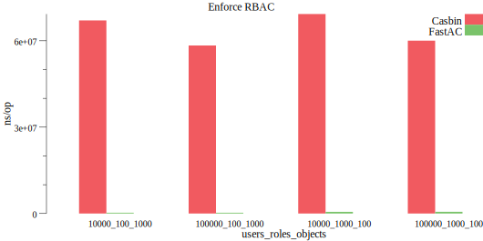
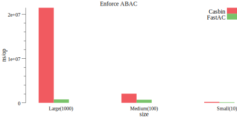

# FastAC

[](https://codecov.io/gh/abichinger/fastac)
[](https://codecov.io/gh/abichinger/fastac)
[](https://goreportcard.com/report/github.com/abichinger/fastac)

FastAC is a drop in replacement for [Casbin](https://github.com/casbin/casbin). In some cases, FastAC can improve the performance significantly.

Please refer to the [Casbin Docs](https://casbin.org/docs/en/how-it-works) for explanation of terms.

# Performance Comparison





# New Features

## Policy Indexing

[Matchers](https://casbin.org/docs/en/syntax-for-models#matchers) can be divided into multiple stages. As a result FastAC will index all policy rules, which reduces the search space for access requests. This feature brings the most **performance gain**.

All you have to do, to take advantage of this is new feature, is to split your matcher definition.

```ini
#Before
[matchers]
m = g(r.sub, p.sub) && r.dom == p.dom && r.obj == p.obj && r.act == p.act
```

```ini
#After
[matchers]
m.0 = r.dom == p.dom
m.1 = g(r.sub, p.sub)
m.2 = r.obj == p.obj && r.act == p.act
```

## Advanced Policy Filtering

FastAC can filter policy with matchers. 

```go
//examples

//get all policy rules belonging to domain1
e.FilterWithMatcher("p.dom == \"domain1\"")

//get all policy rules which grant alice read access
e.FilterWithMatcher("g(\"alice\", p.sub) && p.act == \"read\"")
```

# Feature Overview

- [x] Enforcement
- [x] RBAC
- [x] ABAC
- [x] Adapter
- [x] Default Role Manager
- [ ] Third Party Role Managers
- [ ] Filtered Adapter
- [ ] Watcher
- [ ] Dispatcher

# Adapter List

- [Gorm Adapter](https://github.com/abichinger/gorm-adapter)
